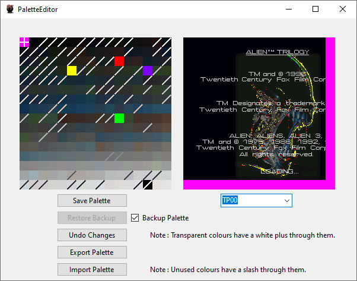

# Alien Trilogy Resurrection

This project aims to create a modding toolkit and possibly more for Alien Trilogy.

- 1 : Install the game from : https://collectionchamber.blogspot.com/2017/05/alien-trilogy.html
- 2 : Download and install the toolkit from here, place it in the same directory as the "Run.exe" file.
	- Currently there is no release so you will have to build it yourself until the time I issue a release.

# Road Map

The road map for this project.

- [✅ 1 : Sound Effects Viewer](#sound-effects-viewer) ( 100% Complete )
	- .RAW audio files can be played and converted to .WAV files.
	- Waveform preview for selected sound files.
	- Automatic backup of the original file by default.
- [✅ 2 : Graphics Viewer](#graphics-viewer) ( 75% Complete )
	- Palette detection implemented.
	- View and replace textures.
	- Automatic backup of the original file by default.
	- Compressed images are not working yet.
- [✅ 3 : Palette Editor](#palette-editor) ( 75% Complete )
	- Palette editor and image preview.
	- Compressed image palettes are not loaded yet.
- [✅ 4 : Text Editor](#text-editor) ( 50% Complete )
	- View text from the games missions and user interface.
	- Editing and saving functions not implemented yet.
- [❌ 5 : Map Editor](#map-editor) ( 1% Complete )
	- Map files detected and listed.

And possibly more to come.

Discord : https://discord.gg/Mk2YUuPmdU

## Documentation

Special thanks to Bobblen147 who created this repository : https://github.com/Bobblen147/atril_geom_extract
They also pointed me to the file format documentation, the links to which are also in their repository on the great preserver archive.org which will save me endless amounts of time manually decoding the filetypes.

## Alien Trilogy Viewer

The main program window.

  

## Sound Effects Viewer

Listen to, extract, replace or restore audio files.

  

## Graphics Viewer

View and extract textures and sprites. (WIP)

  

## Palette Editor

Edit palettes and preview selected image. (WIP)

  

## Text Editor

Edit text in the game, intended for localisation efforts. (WIP)

  

## Map Editor

Preview and edit levels. (WIP)

  

