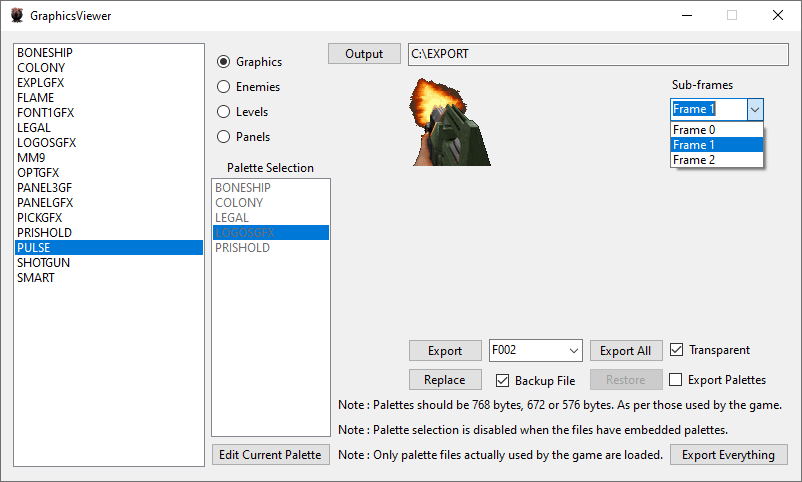

# Alien Trilogy Resurrection

This project aims to create a modding toolkit and possibly more for Alien Trilogy.

- 1 : Install the game from : https://collectionchamber.blogspot.com/2017/05/alien-trilogy.html or from an original media source.
- 2 : Download and install the latest version of the toolkit from [the releases page](https://github.com/Thor110/AlienTrilogyResurrection/releases) then place it in the game directory. ( Alongside "Run.exe" or "TRILOGY.EXE" )
- 3 : Optional : Use the cleanup script and files provided in "Notes\repack-disc-comparison\CLEANUPSCRIPT" to delete 83.35MBs of unused files from the game. ( documentation and details on these files and more can be found in "Notes\repack-disc-comparison\readme.txt" )

# To Do List

Graphics Viewer

- Compressed images can not be replaced yet, until I implement a recompression algorithm that matches the original exactly.

Text Editor

- UI text viewing .BIN files plaintext.
- Editing and saving functionality.

Level Viewer

- Not really a level "viewer" per-se, currently it is just a testing tool for parsing level data, it can also export the level geometry as OBJ files.
- May or may not extend it to level viewer and editor functionality one day.
- Need to implement an export feature for the location of level objects, enemies, crates, pickups, switches, doors etc

# Road Map

The road map for this project.

- [❌ 1 : Text Editor](#text-editor) ( 50% Complete )
	- View text from the games missions and user interface.
	- Editing and saving functions not implemented yet.
- [✅ 2 : Model Viewer](#model-viewer) ( 95% Complete )
	- Can extract models from the three known model files.
	- Does not currently extract the associated textures alongside them.
- [✅ 3 : Graphics Viewer](#graphics-viewer) ( 99% Complete )
	- Palette detection implemented.
	- Toggle palette export or transparency for viewing and exporting.
	- View, export and replace textures, replacing compressed images is not supported yet. ( .B16 files, weapons and enemies. )
	- Automatic backup of the original file by default.
- [✅ 4 : Palette Editor](#palette-editor) ( 100% Complete )
	- Palette editor and image preview.
	- View, export, import and edit palettes for all types of images. ( Embedded, External & Compressed )
	- Visual feedback showing unused colours across all sections and frames, except for embedded palettes where each section has its own colour palette.
	- Automatic backup of the original file by default.
- [✅ 5 : Sound Effects Viewer](#sound-effects-viewer) ( 100% Complete )
	- .RAW audio files can be played, replaced and converted to and from .WAV files.
	- Waveform preview for selected sound files.
	- Link to the music directory, only available with the repack.
	- Automatic backup of the original file by default.
- [❌ 6 : Level Viewer](#level-viewer) ( 75% Complete )
	- Map files detected and listed.
	- Basic details parsed and listed.
	- Export level geometry as OBJ files.

And possibly more to come.

Discord : https://discord.gg/Mk2YUuPmdU

## Documentation

Special thanks to Bobblen147 who created this repository : https://github.com/Bobblen147/atril_geom_extract

They also pointed me to the file format documentation and the source code from Lex Safanov, the links to which are also in their repository on the great preserver archive.org which will save me endless amounts of time manually decoding the filetypes.

Also a big thanks to Lex Safanov for posting their source code for decompression of .B16 files, I used this as reference when reimplementing it for this project.

## Alien Trilogy Viewer

The main program window.

  

## Text Editor

Edit text in the game, intended for localisation efforts.

  

## Model Viewer

Extract models from the games files.

  

A showcase of some of the models from the games files.

  

## Graphics Viewer

View, extract and replace textures from the game.

  

View, extract and replace animation frames in the game. ( Note : Replacing animation frames is not supported yet )

  

Replace textures. ( Example : Barrel texture used for the Crate )

  

## Palette Editor

Preview, edit, save, import and export palettes while previewing the image it belongs to.

  

This image shows a compressed file palette that has been replaced.

  

This image shows an embedded palette that has been replaced.

  

## Sound Effects Viewer

Listen to, extract, replace or restore audio files from backups.

  

## Level Viewer

View level data and export level models as OBJ files.

  

  

