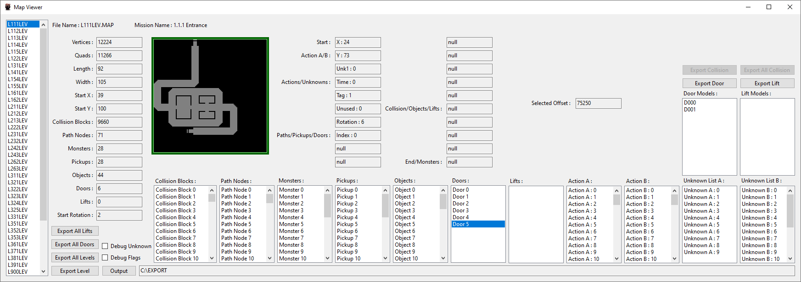

# Alien Trilogy Resurrection

This project aims to create a modding toolkit and possibly more for Alien Trilogy.

- 1 : Install the game from : https://collectionchamber.blogspot.com/2017/05/alien-trilogy.html
- 2 : Download and install the toolkit from here, place it in the same directory as the "Run.exe" file.
- 3 : Optional : Use the cleanup script and files provided in "Notes\repack-disc-comparison\CLEANUPSCRIPT" to delete 83.35MBs of unused files from the game. ( documentation and details on these files and more can be found in "Notes\repack-disc-comparison\readme.txt" )

# To Do List

- Palettes aren't right for the following two files?
	- PANEL3GF.BND
	- PANELGFX.BND
- Compressed images can not be replaced yet, until I implement a recompression algorithm.

# Road Map

The road map for this project.

- [✅ 1 : Sound Effects Viewer](#sound-effects-viewer) ( 100% Complete )
	- .RAW audio files can be played, replaced and converted to and from .WAV files.
	- Waveform preview for selected sound files.
	- Automatic backup of the original file by default.
- [✅ 2 : Graphics Viewer](#graphics-viewer) ( 99% Complete )
	- Palette detection implemented.
	- View, export and replace textures, replacing compressed images is not supported yet. ( .B16 files, weapons and enemies. )
	- Automatic backup of the original file by default.
- [✅ 3 : Palette Editor](#palette-editor) ( 100% Complete )
	- Palette editor and image preview.
	- View, export, import and edit palettes for all types of images. ( Embedded, External & Compressed )
	- Automatic backup of the original file by default.
- [✅ 4 : Text Editor](#text-editor) ( 50% Complete )
	- View text from the games missions and user interface.
	- Editing and saving functions not implemented yet.
- [❌ 5 : Map Editor](#map-editor) ( 1% Complete )
	- Map files detected and listed.

And possibly more to come.

Discord : https://discord.gg/Mk2YUuPmdU

## Documentation

Special thanks to Bobblen147 who created this repository : https://github.com/Bobblen147/atril_geom_extract

They also pointed me to the file format documentation, the links to which are also in their repository on the great preserver archive.org which will save me endless amounts of time manually decoding the filetypes.

## Alien Trilogy Viewer

The main program window.

  

## Sound Effects Viewer

Listen to, extract, replace or restore audio files from backups.

  

## Graphics Viewer

View, extract and replace textures from the game.

  

View, extract and replace animation frames in the game. ( Note : Replacing animation frames is not supported yet )

  

Replace textures. ( Example : Barrel texture used for the Crate )

  

## Palette Editor

Preview, edit, save, import and export palettes while previewing the image it belongs to.

  

This image shos a compressed file palette that has been replaced.

  

This image shows an embedded palette that has been replaced.

  

## Text Editor

Edit text in the game, intended for localisation efforts.

  

## Map Editor

Preview and edit levels. (WIP)

  

