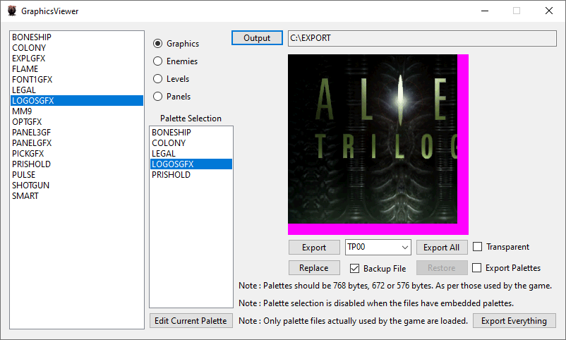
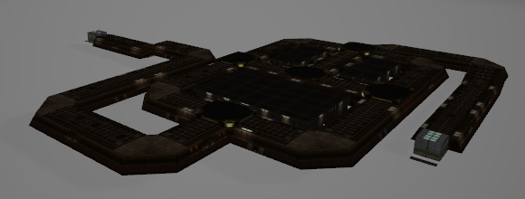
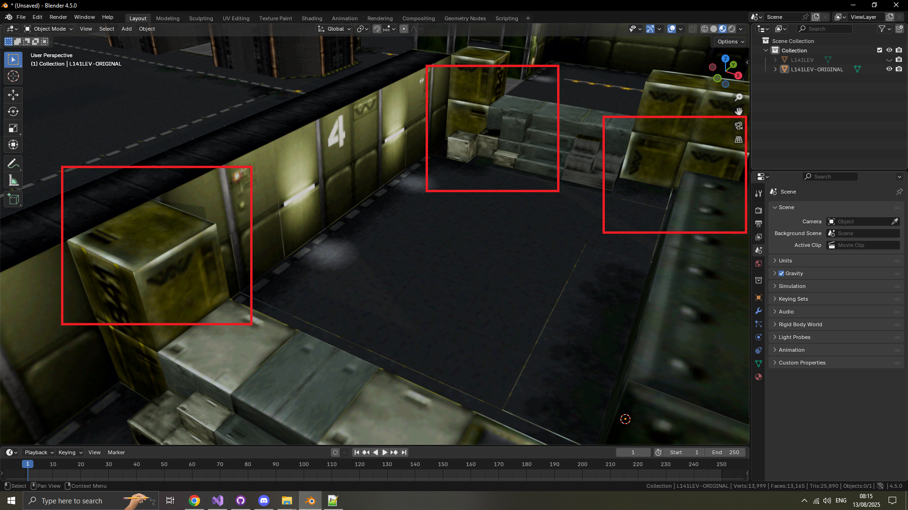
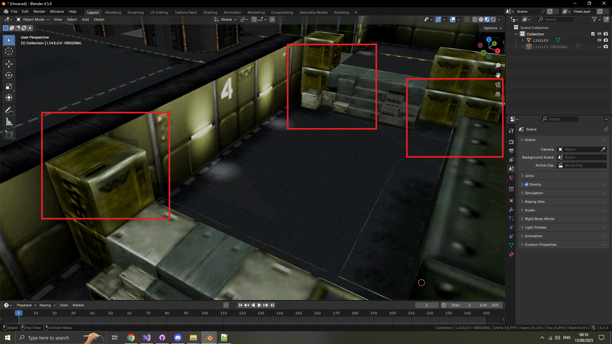
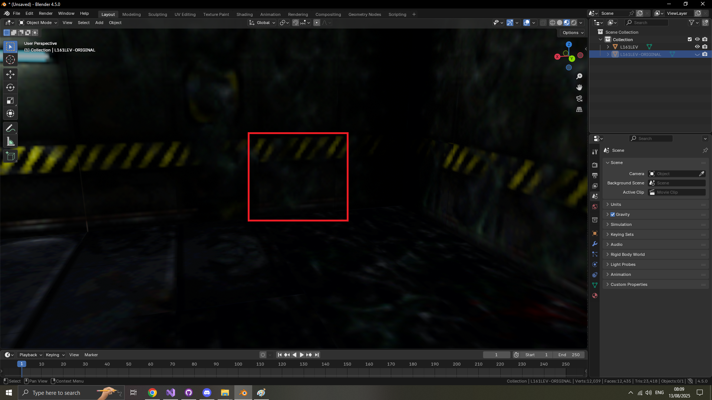

# Alien Trilogy Resurrection

This project aims to create a modding toolkit and possibly more for Alien Trilogy.

- 1 : Install the game from : https://collectionchamber.blogspot.com/2017/05/alien-trilogy.html or from an original media source.
- 2 : Download and install the latest version of the toolkit from [the releases page](https://github.com/Thor110/AlienTrilogyResurrection/releases) then place it in the game directory. ( Alongside "Run.exe" or "TRILOGY.EXE" )
- 3 : Optional : Use the cleanup script and files provided in "Notes\repack-disc-comparison\CLEANUPSCRIPT" to delete 83.35MBs of unused files from the game. ( documentation and details on these files and more can be found in "Notes\repack-disc-comparison\readme.txt" )
- 4 : Optional : Install any patches from the "Patch" folder, currently there is only one.

# To Do List

Text Editor

- UI text viewing .BIN files plaintext.
- Editing and saving functionality.

Model Viewer

- M036, M039 & M040 textures are not determined yet.

Graphics Viewer

- Compressed images can not be replaced yet, until I implement a recompression algorithm that matches the original exactly.

Level Viewer

- Not really a level "viewer" per-se, currently it is just a testing tool for parsing level data, it can also export the level geometry as OBJ files.
- May or may not extend it to level viewer and editor functionality one day.
- Need to implement an export feature for the location of level objects, enemies, crates, pickups, switches, doors etc

Patches

- Multiple UVs across the games levels, lifts and doors need fixing.
- The UVs for the Queens Egg Sack from the final level need fixing.
- A trigger for a lift with an inaccessible secret needs fixing on L371LEV as noted by Bobblen. ( https://www.avpgalaxy.net/forum/index.php?topic=67544.0 )

# Road Map

The road map for this project.

- [❌ 1 : Text Editor](#text-editor) ( 50% Complete )
	- View text from the games missions and user interface.
	- Editing and saving functions not implemented yet.
- [✅ 2 : Model Viewer](#model-viewer) ( 99% Complete )
	- Can extract models from the three known model files.
	- Does not currently extract the associated textures alongside them.
- [✅ 3 : Graphics Viewer](#graphics-viewer) ( 99% Complete )
	- Palette detection implemented.
	- Toggle palette export or transparency for viewing and exporting.
	- View, export and replace textures, replacing compressed images is not supported yet. ( .B16 files, weapons and enemies. )
	- Automatic backup of the original file by default.
- [✅ 4 : Palette Editor](#palette-editor) ( 100% Complete )
	- Palette editor and image preview.
	- View, export, import and edit palettes for all types of images. ( Embedded, External & Compressed )
	- Visual feedback showing unused colours across all sections and frames, except for embedded palettes where each section has its own colour palette.
	- Automatic backup of the original file by default.
- [✅ 5 : Sound Effects Viewer](#sound-effects-viewer) ( 100% Complete )
	- .RAW audio files can be played, replaced and converted to and from .WAV files.
	- Waveform preview for selected sound files.
	- Link to the music directory, only available with the repack.
	- Automatic backup of the original file by default.
- [❌ 6 : Level Viewer](#level-viewer) ( 95% Complete )
	- Map files detected and listed.
	- Basic details parsed and listed.
	- Export level geometry as OBJ files.
	- Export levels with debug and unknown byte flags displayed visually.
	- Export door and lift geometry as OBJ files.
	- Does not currently extract the associated textures alongside them.
- [❌ 7 : Patches](#patches) ( ??% Complete )
	- [Patched an issue on L906LEV where a vertex had incorrect coordinates.](#L906LEV-Multiplayer-Map-7-Fix-1)
	- [Patched an issue on L906LEV where four faces were lacking the double sided transparency flag.](#L906LEV-Multiplayer-Map-7-Fix-2)
	- [Patched an issue on L906LEV where one railing was lacking the double sided transparency flag.](#L906LEV-Multiplayer-Map-7-Fix-3)
	- [Patched an issue on L906LEV where one railing was lacking the double sided transparency flag.](#L906LEV-Multiplayer-Map-7-Fix-4)
	- [Patched an issue on L906LEV where 8 different bridge sections had incorrect textures and UV coordinates.](#L906LEV-Multiplayer-Map-7-Fix-5)
	- [Patched an issue on L905LEV where 2 textures were flipped when they shouldn't have been.](#L905LEV-Multiplayer-Map-6-Fix-1)
	- [Patched an issue on L905LEV where lots of different textures were flipped when they shouldn't have been.](#L905LEV-Multiplayer-Map-6-Fix-2)
	- [Patched an issue on L903LEV where some crates had incorrect textures.](#L903LEV-Multiplayer-Map-4-Fix-1)
	- [Patched an issue on L900LEV where four crates had textures which were sideways.](#L900LEV-Multiplayer-Map-1-Fix-1)
	- [Patched an issue on L111LEV where four crates had textures which were sideways.](#L111LEV-Fix-1)
	- [Patched an issue on L141LEV where some crates had incorrect textures.](#L141LEVFix-1)
	- [Patched an issue on L161LEV where one face had an incorrect texture.](#L161LEVFix-1)
- [✅ 8 : Easter Eggs](#easter-eggs) ( ??% Complete )

And possibly more to come.

Discord : https://discord.gg/Mk2YUuPmdU

## Documentation

Special thanks to Bobblen147 who created this repository : https://github.com/Bobblen147/atril_geom_extract

They also pointed me to the file format documentation and the source code from Lex Safanov, the links to which are also in their repository on the great preserver archive.org which will save me endless amounts of time manually decoding the filetypes.

Also a big thanks to Lex Safanov for posting their source code for decompression of .B16 files, I used this as reference when reimplementing it for this project.

## Alien Trilogy Viewer

The main program window.

  

## Text Editor

Edit text in the game, intended for localisation efforts.

  

## Model Viewer

Extract models from the games files.

  

A showcase of some of the models from the games files.

  

## Graphics Viewer

View, extract and replace textures from the game.

  

View, extract and replace animation frames in the game. ( Note : Replacing animation frames is not supported yet )

  

Replace textures. ( Example : Barrel texture used for the Crate )

  

## Palette Editor

Preview, edit, save, import and export palettes while previewing the image it belongs to.

  

This image shows a compressed file palette that has been replaced.

  

This image shows an embedded palette that has been replaced.

  

## Sound Effects Viewer

Listen to, extract, replace or restore audio files from backups.

  

## Level Viewer

View level data and export level models as OBJ files.

  

Preview of L111LEV exported as an OBJ file.

  

A view of L112LEV from within Blender.

  

A preview of the door D000 from L111LEV.

  

A preview of the lift L000 from L232LEV.

  

## Patches

I am also looking at making patches for any issues I find in the original game.
- Patched an issue on L906LEV where a vertex had incorrect coordinates.
- Patched an issue on L906LEV where four faces were lacking the double sided transparency flag.
- Patched an issue on L906LEV where one railing was lacking the double sided transparency flag.
- Patched an issue on L906LEV where one railing was lacking the double sided transparency flag.
- Patched an issue on L906LEV where 8 different bridge sections had incorrect textures and UV coordinates.
- Patched an issue on L905LEV where 2 textures were flipped when they shouldn't have been.
- Patched an issue on L905LEV where lots of different textures were flipped when they shouldn't have been.
- Patched an issue on L903LEV where some crates had incorrect textures.
- Patched an issue on L900LEV where four crates had textures which were sideways.
- Patched an issue on L111LEV where four crates had textures which were sideways.
- Patched an issue on L141LEV where some crates had incorrect textures.
- Patched an issue on L161LEV where one face had an incorrect texture.

## L906LEV Multiplayer Map 7 Fix 1

Here is how the level was originally.

  

This would cause this to appear when close enough to the missing triangle.

  

Here it is with the fix I applied to the level.

  

## L906LEV Multiplayer Map 7 Fix 2

Here is how the level was originally.

  

Here it is with the fix I applied to the level.

  

## L906LEV Multiplayer Map 7 Fix 3

Here is how the level was originally.

  

Here it is with the fix I applied to the level.

  

## L906LEV Multiplayer Map 7 Fix 4

Here is how the level was originally.

  

Here it is with the fix I applied to the level.

  

## L906LEV Multiplayer Map 7 Fix 5

Here is how the level was originally.

  

Here it is with the fix I applied to the level.

  

Currently this is only fixed when exporting the model and partially fixed in the original game files.

## L905LEV Multiplayer Map 6 Fix 1

Here is how the level was originally.

  

Here it is with the fix I applied to the level.

  

## L905LEV Multiplayer Map 6 Fix 2

Here is how the level was originally.

  

Here it is with the fix I applied to the level.

  

## L903LEV Multiplayer Map 4 Fix 1

These fixes are the same as on L141LEV

Currently this is only fixed when exporting the level model.

## L900LEV Multiplayer Map 1 Fix 1

These fixes are the same as on L111LEV

Currently this is only fixed when exporting the level model.

## L111LEV Fix 1

These fixes are the same as on L900LEV

Here is how the level was originally.

  

Here it is with the fix I applied to the level.

  

Currently this is only fixed when exporting the level model.

## L141LEV Fix 1

These fixes are the same as on L903LEV

Here is how the level was originally.

  

Here it is with the fixes I applied to the level.

  

Here is how the level was originally.

  

Here it is with the fixes I applied to the level.

  

Currently this is only fixed when exporting the level model.

There are a few other similar issues with textures that I have fixed but which I have not screenshotted here, the exact indices of the faces which have been adjusted can be found in the code : (https://github.com/Thor110/AlienTrilogyResurrection/blob/main/ALTViewer/ModelRenderer.cs#L267)

## L161LEV Fix 1

Here is how the level was originally.

  

Here it is with the fix I applied to the level.

  

Currently this is only fixed when exporting the level model.

## Easter Eggs

Object type 33 is the Steel Coil, which may be a nod to Grade 33 steel, the first widely adopted U.S. structural steel grade (ASTM A15, 1911).

  

The object type is stored in a byte (0-255) so if the assignment is random and every one of the 256 potential values is equally likely, the chance the Steel Coil specifically lands on 33 is 1 ÷ 256 = 0.00390625 = 0.390625% (~0.39%).